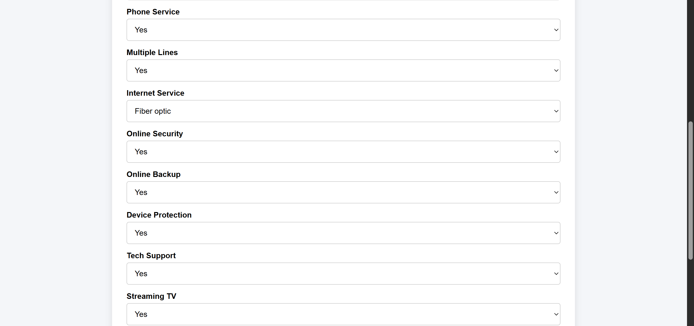
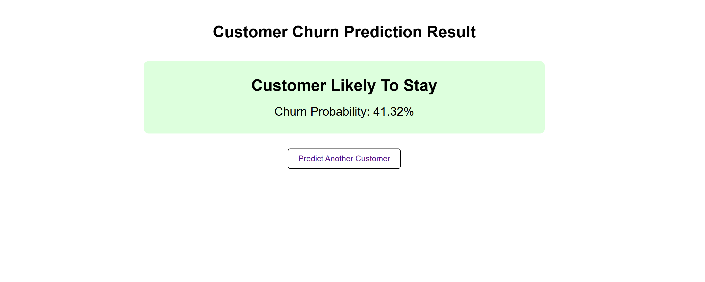

# Customer Churn Prediction System

An end-to-end Machine Learning project that predicts whether a telecom customer is likely to churn (leave the service) based on customer demographics, account information, and service usage patterns.

The project covers the complete ML lifecycle:

- Data Analysis
- Data Preprocessing
- Feature Engineering
- Model Training
- Hyperparameter Tuning
- Model Evaluation
- Model Serialization
- Flask API Development
- Web UI Development

---

## Project Demo

### Customer Input Form



### Prediction Result



---

## Problem Statement

Customer churn is one of the biggest challenges faced by subscription-based businesses.

Acquiring a new customer is often significantly more expensive than retaining an existing one.

The objective of this project is to build a machine learning system capable of predicting customer churn so that businesses can proactively identify at-risk customers and improve retention strategies.

---

## Dataset

Dataset: Telco Customer Churn Dataset

Target Variable:

- Churn
    - Yes = Customer left
    - No = Customer stayed

Features include:

### Customer Information

- Gender
- Senior Citizen
- Partner
- Dependents

### Account Information

- Tenure
- Contract Type
- Paperless Billing
- Payment Method

### Services Used

- Phone Service
- Multiple Lines
- Internet Service
- Online Security
- Online Backup
- Device Protection
- Tech Support
- Streaming TV
- Streaming Movies

### Billing Information

- Monthly Charges
- Total Charges

---

## Project Workflow

### Phase 1 — Exploratory Data Analysis (EDA)

Performed detailed data exploration to understand:

- Data types
- Missing values
- Target distribution
- Feature distributions
- Correlations
- Business insights

---

### Phase 2 — Data Cleaning

Performed:

- Missing value handling
- TotalCharges datatype correction
- Data consistency checks

---

### Phase 3 — Feature Engineering

Applied:

- One-Hot Encoding
- Feature transformation
- Numerical feature preparation

---

### Phase 4 — Data Splitting

Created:

- Training Set
- Testing Set

Using:

```python
train_test_split()
```

---

### Phase 5 — Baseline Model

Trained Logistic Regression as the baseline model.

Metrics evaluated:

- Accuracy
- Precision
- Recall
- F1 Score
- ROC-AUC

---

### Phase 6 — Model Comparison

Compared multiple models:

- Logistic Regression
- Random Forest
- Gradient Boosting

Selected the best-performing model based on evaluation metrics.

---

### Phase 7 — Hyperparameter Tuning

Performed tuning to improve model performance and generalization.

Techniques:

- Grid Search
- Cross Validation

---

### Phase 8 — Model Serialization

Saved trained artifacts using Joblib:

```python
joblib.dump()
```

Artifacts saved:

- Trained Model
- Scaler
- Feature Names

---

### Phase 9 — Flask Prediction API

Built REST API endpoints:

### Home Route

```http
GET /
```

### Prediction Route

```http
POST /predict
```

Accepts JSON input and returns prediction results.

---

### Phase 10 — Web Interface

Developed a user-friendly web interface using:

- HTML
- CSS
- Flask Templates

Users can:

- Enter customer information
- Submit prediction requests
- View churn probability

---

### Phase 11 — Result Dashboard

Created a prediction results page displaying:

- Churn Prediction
- Churn Probability
- Customer Risk Assessment

---

## Model Pipeline

Input Data

↓

Feature Encoding

↓

Feature Alignment

↓

Feature Scaling

↓

Logistic Regression Model

↓

Prediction + Probability

↓

Flask API

↓

Web UI

---

## Technologies Used

### Programming Language

- Python

### Data Analysis

- Pandas
- NumPy

### Visualization

- Matplotlib
- Seaborn

### Machine Learning

- Scikit-Learn

### Model Serialization

- Joblib

### Backend

- Flask

### Frontend

- HTML
- CSS

### Version Control

- Git
- GitHub

---

## Project Structure

```text
Customer_Churn_Prediction_System/

├── data/
│   └── raw/
│       └── WA_Fn-UseC_-Telco-Customer-Churn.csv

├── models/
│   ├── logistic_regression_model.pkl
│   ├── scaler.pkl
│   └── feature_names.pkl

├── notebooks/
│   └── 01_EDA.ipynb

├── screenshots/
│   ├── input_form.png
│   └── prediction_result.png

├── src/
│   ├── app.py
│   └── templates/
│       ├── index.html
│       └── result.html

├── requirements.txt
├── README.md
└── .gitignore
```


## Installation

### Clone Repository

```bash
git clone https://github.com/rishikeshsinha7091/Customer-Churn-Prediction-System.git
```

### Move Into Project

```bash
cd Customer-Churn-Prediction-System
```

### Create Virtual Environment

```bash
python -m venv .venv
```

### Activate Virtual Environment

Windows:

```bash
.venv\Scripts\activate
```

### Install Dependencies

```bash
pip install -r requirements.txt
```

---

## Running The Application

```bash
python src/app.py
```

Application will be available at:

```text
http://127.0.0.1:5000
```

---

## API Example

### Request

```json
{
    "gender":"Male",
    "SeniorCitizen":0,
    "Partner":"Yes",
    "Dependents":"No",
    "tenure":24,
    "PhoneService":"Yes",
    "MultipleLines":"Yes",
    "InternetService":"Fiber optic",
    "OnlineSecurity":"Yes",
    "OnlineBackup":"No",
    "DeviceProtection":"Yes",
    "TechSupport":"No",
    "StreamingTV":"Yes",
    "StreamingMovies":"Yes",
    "Contract":"One year",
    "PaperlessBilling":"Yes",
    "PaymentMethod":"Credit card (automatic)",
    "MonthlyCharges":85.5,
    "TotalCharges":2052.0
}
```

### Response

```json
{
    "prediction": 0,
    "churn_probability": 0.4132
}
```

---

## Future Improvements

Potential enhancements:

- XGBoost Integration
- LightGBM Integration
- Docker Containerization
- Cloud Deployment
- User Authentication
- Database Integration
- Interactive Analytics Dashboard
- Real-Time Monitoring

---

## Learning Outcomes

Through this project, I gained practical experience in:

- Exploratory Data Analysis
- Data Preprocessing
- Feature Engineering
- Model Evaluation
- Hyperparameter Tuning
- Machine Learning Pipelines
- Model Serialization
- Flask Development
- REST API Design
- Git and GitHub Workflow

---

## Author

Rishikesh Sinha

B.Tech Electronics and Communication Engineering

Netaji Subhas University of Technology (NSUT)

GitHub:
https://github.com/rishikeshsinha7091